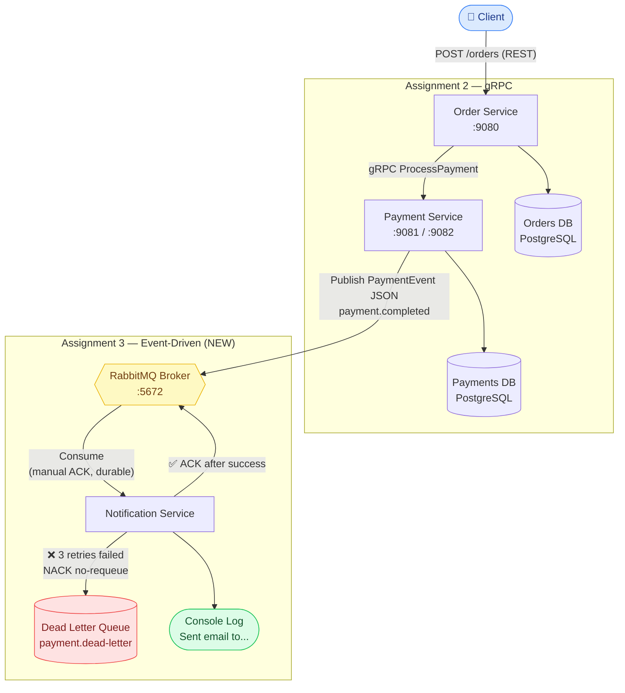

# AP2 Assignment 3 — Event-Driven Architecture with Message Queues

**Student:** Chingiz Uraimov  
**Group:** SE-2405  

## Repository Links
- **Proto Repository:** https://github.com/Hanulus/ap2-protos
- **Generated Code Repository:** https://github.com/Hanulus/ap2-generated

---

## Architecture (Assignment 3)



**Поток событий:**
1. Client → `POST /orders` → Order Service сохраняет заказ (Pending), вызывает Payment по gRPC
2. Payment Service сохраняет в БД, публикует `PaymentEvent` JSON в очередь `payment.completed`
3. Notification Service получает событие, логирует email, отправляет manual ACK
4. Тот же event_id приходит снова → idempotency check пропускает дубль
5. Ошибка 3 раза подряд → сообщение уходит в `payment.dead-letter` (DLQ)

---

## Idempotency Strategy

**Problem:** RabbitMQ guarantees *at-least-once* delivery — a message can be re-delivered if the consumer crashes before ACKing.

**Solution:** Each `PaymentEvent` contains a globally unique `event_id` (UUID generated by the producer). The Notification Service maintains an in-memory `map[string]bool` guarded by a mutex:

```
1. Message arrives
2. Check if event_id already in processedIDs map
3a. YES → log "DUPLICATE skipped", ACK (remove from queue), return
3b. NO  → mark event_id as processed, continue to send notification, ACK
```

This ensures the email log is printed **exactly once** per unique payment event, even if the same message is delivered multiple times.

> For production use, replace the in-memory map with a database table (e.g. `processed_events(event_id PRIMARY KEY)`) so idempotency survives service restarts.

---

## ACK Logic (Manual Acknowledgment)

Auto-ACK is **disabled** (`autoAck: false`). The sequence is:

```
Receive message
      ↓
Parse JSON
  ├─ FAIL → Nack(requeue=false) → message goes to DLQ immediately
  └─ OK
        ↓
  Idempotency check
  ├─ DUPLICATE → Ack (remove duplicate without processing)
  └─ NEW
        ↓
  Simulate sending email (log to console)
        ↓
  Ack(false)   ← manual ACK only AFTER successful processing
```

This guarantees **at-least-once delivery**: if the service crashes between receiving the message and ACKing it, RabbitMQ will re-deliver the message to the next available consumer.

---

## Dead Letter Queue (Bonus +10%)

**Setup:**
- `payment.dlx` — direct exchange for dead letters
- `payment.dead-letter` — queue bound to the DLX
- `payment.completed` — main queue configured with `x-dead-letter-exchange: payment.dlx`

**Retry logic (in Notification Service):**
- Events where `order_id` starts with `"fail-"` simulate a permanent processing error
- The consumer tracks retry attempts per `event_id` in an in-memory counter
- Attempts 1 & 2: `Nack(requeue=true)` — message is requeued
- Attempt 3: `Nack(requeue=false)` — message is rejected and routed to `payment.dead-letter`

**Demo:** Create a payment with `order_id = "fail-demo"` and watch the logs show 3 attempts followed by DLQ routing.

---

## Reliability Guarantees

| Feature | Implementation |
|---|---|
| Durable queues | `QueueDeclare(durable=true)` — survives broker restart |
| Persistent messages | `DeliveryMode: amqp.Persistent` — survives broker restart |
| Manual ACK | `autoAck: false` — ACK only after successful processing |
| Idempotency | In-memory `map[string]bool` keyed by `event_id` |
| Dead Letter Queue | `x-dead-letter-exchange` after 3 failed attempts |
| Graceful Shutdown | `os/signal` → `http.Server.Shutdown()` + `grpcServer.GracefulStop()` |

---

## How to Run

### Prerequisites
- Docker & Docker Compose

### Start all services
```bash
docker-compose up --build
```

This starts:
- `orders-db` — PostgreSQL for orders
- `payments-db` — PostgreSQL for payments
- `rabbitmq` — RabbitMQ broker (management UI at http://localhost:15672, guest/guest)
- `payment-service` — REST `:9081`, gRPC `:9082`
- `order-service` — REST `:9080`
- `notification-service` — RabbitMQ consumer

### Create an order (triggers the full event flow)
```bash
curl -X POST http://localhost:9080/orders \
  -H "Content-Type: application/json" \
  -d '{"customer_id":"cust-1","item_name":"Book","amount":500}'
```

Watch `notification-service` logs:
```
[Notification] Sent email to customer-XXXXXXXX@example.com for Order #<uuid>. Amount: $5.00
```

### Trigger DLQ demo (bonus)
```bash
curl -X POST http://localhost:9081/payments \
  -H "Content-Type: application/json" \
  -d '{"order_id":"fail-demo-1","amount":100}'
```

Watch logs: 3 retry attempts → message moves to `payment.dead-letter` queue (visible in RabbitMQ management UI).

---

## What Changed from Assignment 2

- **Payment Service** now publishes a `PaymentEvent` JSON to RabbitMQ after each authorized payment
- **Notification Service** (new) consumes events asynchronously — fully decoupled from Order/Payment
- **docker-compose** extended with RabbitMQ + notification-service
- **Graceful shutdown** added to Payment Service (`SIGINT`/`SIGTERM` handling)
- **DLQ** configured for failure handling with retry logic
