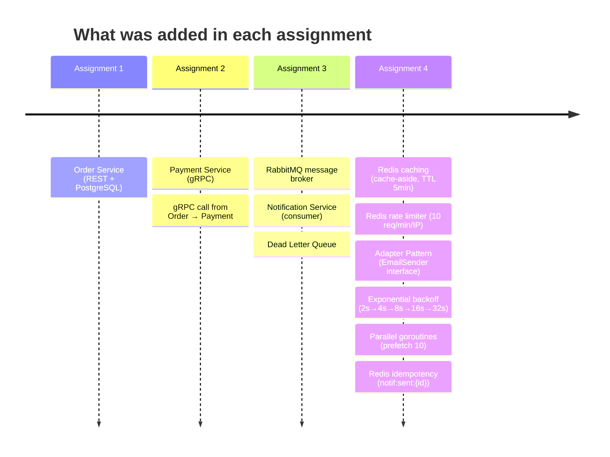
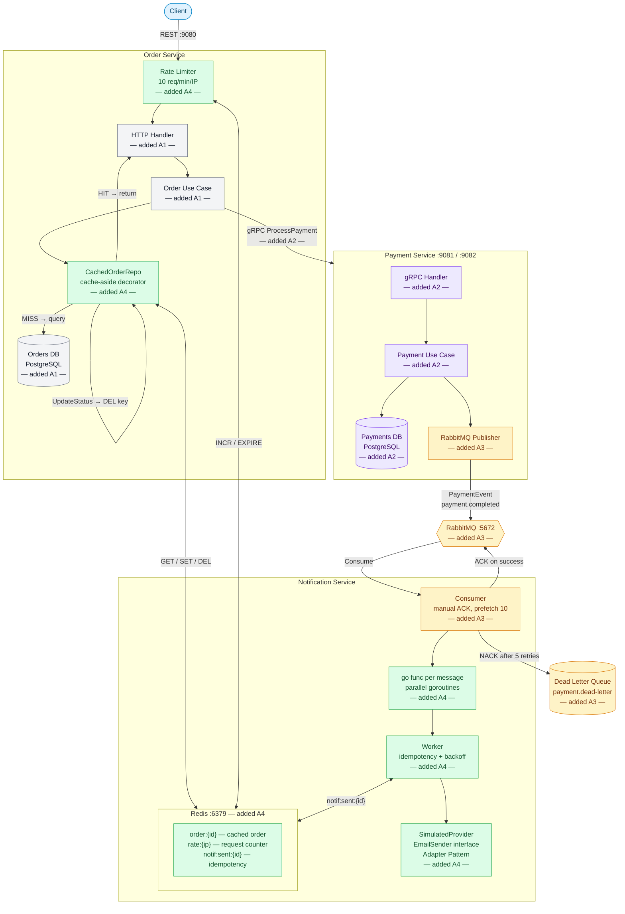

# AP2 Assignments 1–4 — Microservices in Go

**Student:** Chingiz Uraimov  
**Group:** SE-2405

---

## System Evolution Across Assignments



---

## Full Architecture (Assignment 4)



**Legend:** grey = A1 · purple = A2 · orange = A3 · green = A4

---

## Component Map

| Component | File | Added in |
|-----------|------|----------|
| Order HTTP handler | `order-service/internal/transport/http/handler.go` | A1 |
| Order use case | `order-service/internal/usecase/order.go` | A1 |
| Orders PostgreSQL repo | `order-service/internal/repository/postgres.go` | A1 |
| Payment gRPC handler | `payment-service/internal/transport/grpc/handler.go` | A2 |
| Payment gRPC client | `order-service/internal/repository/payment_grpc_client.go` | A2 |
| RabbitMQ publisher | `payment-service/internal/infrastructure/rabbitmq/publisher.go` | A3 |
| RabbitMQ consumer | `notification-service/internal/consumer/rabbitmq.go` | A3 |
| Dead Letter Queue | declared in `consumer/rabbitmq.go` | A3 |
| Redis cache decorator | `order-service/internal/cache/order_cache.go` | A4 |
| Rate limiter middleware | `order-service/internal/transport/http/middleware/rate_limiter.go` | A4 |
| EmailSender interface | `notification-service/internal/provider/provider.go` | A4 |
| SimulatedProvider | `notification-service/internal/provider/simulated.go` | A4 |
| Worker (backoff + idempotency) | `notification-service/internal/worker/worker.go` | A4 |
| Parallel goroutines | `notification-service/internal/consumer/rabbitmq.go:110` | A4 |

---

## Cache-Aside Pattern (Assignment 4)

```
GET /orders/:id
  → Check Redis "order:{id}"
  → HIT:  return cached JSON               ← no DB query
  → MISS: query PostgreSQL
          → write to Redis TTL 5 min
          → return result

UpdateStatus (after payment / cancel)
  → UPDATE orders SET status = ...
  → DEL "order:{id}"                       ← immediate invalidation
```

---

## Rate Limiter (Assignment 4 — Bonus +10%)

```
key = "rate:{client_ip}"

INCR key → count
if count == 1 → EXPIRE key 60s
if count > 10 → HTTP 429 Too Many Requests
```

Config: `RATE_LIMIT_MAX=10`, `RATE_LIMIT_WINDOW_SECONDS=60`

---

## Notification Reliability (Assignment 4)

### Idempotency
```
key = "notif:sent:{payment_id}"
EXISTS? YES → skip (duplicate)
        NO  → send → SET key EX 86400
```

### Exponential Backoff
```
attempt 1 → FAIL → sleep 2s
attempt 2 → FAIL → sleep 4s
attempt 3 → FAIL → sleep 8s
attempt 4 → FAIL → sleep 16s
attempt 5 → FAIL → NACK → Dead Letter Queue
```

### Parallel Processing
Each RabbitMQ message spawns a goroutine (`go func()`).  
Prefetch = 10 — up to 10 messages in-flight simultaneously.

---

## How to Run

```bash
DOCKER_BUILDKIT=0 docker-compose up --build
```

| Service | URL |
|---------|-----|
| Order Service REST | http://localhost:9080 |
| Payment Service REST | http://localhost:9081 |
| RabbitMQ Management | http://localhost:15672 (guest/guest) |
| Redis | localhost:6379 |
